## docker

### 安装

- 配置yum源

  ```sh
  # 安装工具
  sudo yum install -y yum-utils
  
  # 配置源
  sudo yum-config-manager \
  --add-repo \
  http://mirrors.aliyun.com/docker-ce/linux/centos/docker-ce.repo
  
  ```

- 安装docker

  ```sh
  sudo yum install -y docker-ce docker-ce-cli containerd.io
  
  
  #以下是在安装k8s的时候使用（版本不同）
  yum install -y docker-ce-20.10.7 docker-ce-cli-20.10.7  containerd.io-1.4.6
  ```

- 启动

  ```sh
  systemctl enable docker --now
  ```

- 配置加速器

  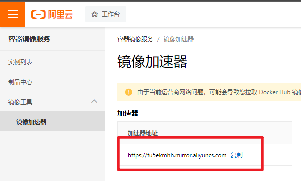

  ```sh
  sudo mkdir -p /etc/docker
  sudo tee /etc/docker/daemon.json <<-'EOF'
  {
    "registry-mirrors": ["https://fu5ekmhh.mirror.aliyuncs.com"],
    "exec-opts": ["native.cgroupdriver=systemd"],
    "log-driver": "json-file",
    "log-opts": {
      "max-size": "100m"
    },
    "storage-driver": "overlay2"
  }
  EOF
  sudo systemctl daemon-reload
  sudo systemctl restart docker
  ```

### 使用

#### 常规

- 下载镜像

  ```http
  https://hub.docker.com/
  ```

  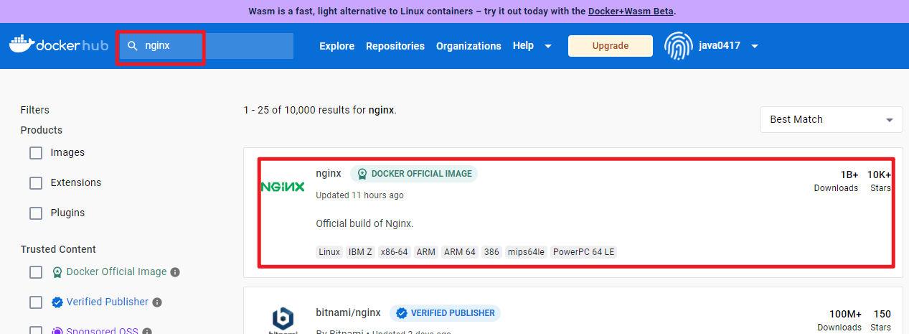

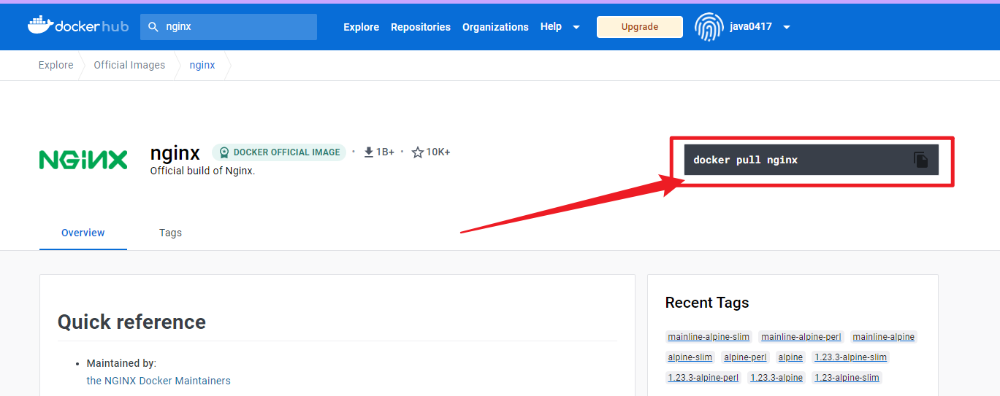

- 下载镜像

  ```sh
  docker pull nginx # 最新版
  ```

- 下载指定版本

  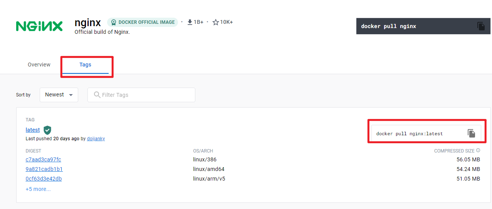

```sh
docker pull nginx:mainline-alpine
```

- 查看镜像列表

  ```sh
  docker images
  ```

- 删除镜像

  ```sh
  docker rmi nginx
  ```

- 启动镜像

  ```sh
  docker run --name=mynginx -d  nginx
  docker run --name=mynginx --restart=always -d  nginx
  docker run --name=mynginx --restart=always -d -p 88:80  nginx
  docker run --name=mynginx --restart=always -d -p 88:80 -v /data/html:/usr/share/nginx/html:ro nginx
  
  # -d : 后台运行
  #  --restart=always ：开机自己启动
  # -p 88:80 :端口映射，主机88映射到容器的80
  # -v /data/html:/usr/share/nginx/html:ro 挂载  ro：只读 rw 读写
  ```

- 删除容器

  ```sh
  docker rm mynginx #只能删除已经停止的
  docker rm -f mynginx # 强制删除
  ```

- 查看容器

  ```sh
  docker ps # 查看运行的
  docker ps -a # 查看所有
  ```

- 停止容器

  ```sh
  docker stop mynginx 
  ```

- 启动容器

  ```sh
  docker start 容器ID 
  ```

- 修改镜像配置

  ```sh
  docker update 容器id --restart=always
  ```

- 端口映射

  ```sh
  # 主机88映射到容器的80
  docker run -p 88:80  nginx
  ```

#### 其他

- 进入其中

```sh
#进入容器
docker exec -it 65fc3ea9f5d9 /bin/bash

# 进入静态页面
cd usr/share/nginx/html/

# 退出
exit
```

- 提交改变

  ```sh
  # 打包到本地，并没有push到网上仓库
  docker commit -a "zhangyixiong" -m "测试提交" 65fc3ea9f5d9 xiong:v1.0
  docker images
  ```

- 打包分享

  ```sh
  # 将镜像做成压缩包，其他的机器可以加载此压缩包
  docker save -o abc.tar xiong:v1.0
  # 加载压缩包
  docker load -i abc.tar
  ```

- 推送远程仓库

  创建远程仓库

  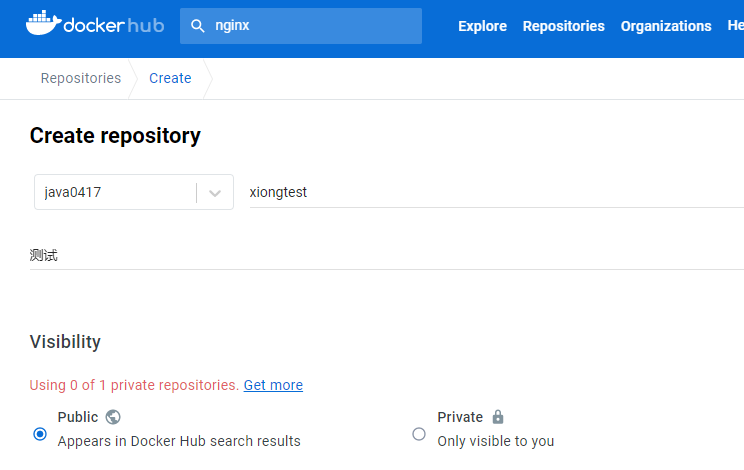

```sh
# 打包
docker tag xiong:v1.0 java0417/xiongtest:v1.0
docker images

#登录
docker login
# java0417
# xiong1991
# 退出
docker logout

# 推送
docker push java0417/xiongtest:v1.0
```

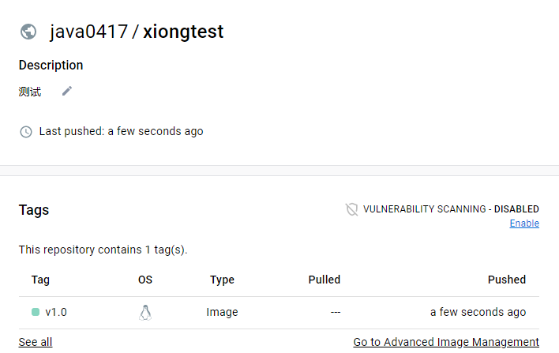

#### 挂载数据

```sh
# 挂载
docker run --name=mynginx --restart=always -d -p 88:80 -v /data/html:/usr/share/nginx/html:ro nginx
# 修改
cd /data/html
/data/html
```

#### 其他

- 查看日志

  ```sh
  docker logs 容器id
  ```

- 挂载配置文件

  ```sh
  docker logs 容器名/id   排错
  
  docker exec -it 容器id /bin/bash
  
  # docker 经常修改nginx配置文件
  docker run -d -p 80:80 \
  -v /data/html:/usr/share/nginx/html:ro \
  -v /data/conf/nginx.conf:/etc/nginx/nginx.conf \
  --name mynginx-02 \
  nginx
  
  #把容器指定位置的东西复制出来 
  docker cp 5eff66eec7e1:/etc/nginx/nginx.conf  /data/conf/nginx.conf
  #把外面的内容复制到容器里面
  docker cp  /data/conf/nginx.conf  5eff66eec7e1:/etc/nginx/nginx.conf
  ```

  

### 使用docker打包部署（实战）

#### 单机打包部署

- 创建项目，编写dockerfile

  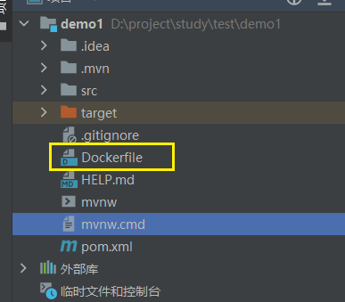

- 在dockerhub中 寻找jdk环境

  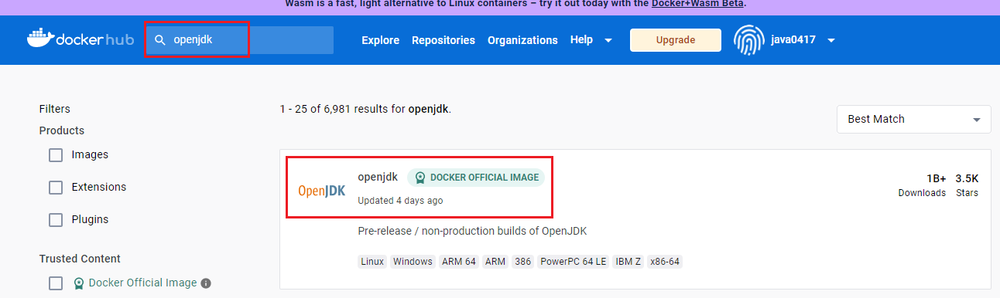

  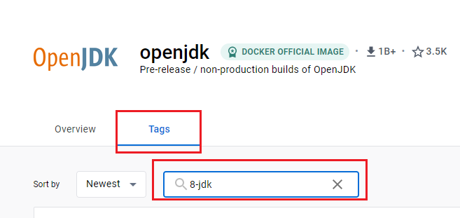

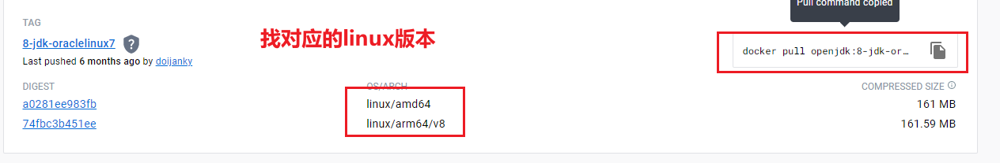

- dockerfile

  ```sh
  # 运行环境
  FROM openjdk:8-jdk-oraclelinux7
  
  # 作者
  LABEL maintainer=zhangyixiong
  
  # 复制jar包 到容器中
  COPY target/*.jar /app.jar
  
  # 启动命令
  ENTRYPOINT ["java","-jar","app.jar"]
  ```

- 将dockerfile和target 传到服务器,在dockerfile 目录执行

  ```sh
  docker build -t java-demo:v1.0 . -f ./Dockerfile
  # -t : 镜像名称
  # . ：在当前目录下进行
  # -f :指定dockerfile
  docker images 
  ```

- 运行镜像

  ```sh
  docker run -d -p 8080:8080 --name myjava java-demo:v1.0 
  docker ps
  # 查看日志
  docker logs 容器id
  ```

#### 分享部署

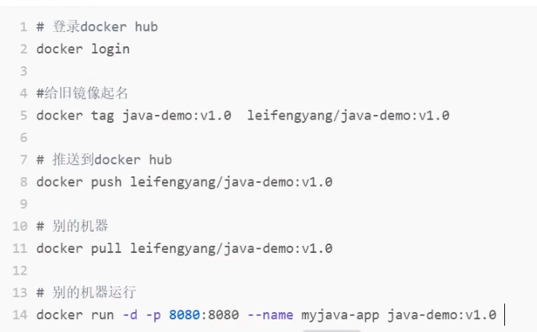

## K8S

### 创建运行环境

- 创建三台服务器 node-1、node-2、master

- 安装docker

- 设置主机名（不能重复）

  ```sh
  #修改三台
  hostnamectl set-hostname k8s-master
  hostnamectl set-hostname k8s-node1
  hostnamectl set-hostname k8s-node2
  # 查看主机名
  hostname
  ```

- 其他设置

  ```sh
  
  #各个机器设置自己的域名
  hostnamectl set-hostname xxxx
  
  
  # 将 SELinux 设置为 permissive 模式（相当于将其禁用）
  sudo setenforce 0
  sudo sed -i 's/^SELINUX=enforcing$/SELINUX=permissive/' /etc/selinux/config
  
  #关闭swap
  swapoff -a  
  sed -ri 's/.*swap.*/#&/' /etc/fstab
  
  #允许 iptables 检查桥接流量
  cat <<EOF | sudo tee /etc/modules-load.d/k8s.conf
  br_netfilter
  EOF
  
  cat <<EOF | sudo tee /etc/sysctl.d/k8s.conf
  net.bridge.bridge-nf-call-ip6tables = 1
  net.bridge.bridge-nf-call-iptables = 1
  EOF
  sudo sysctl --system
  
  ```

### 安装kubelet、kubeadm、kubectl

```sh
# 修改配置源
cat <<EOF | sudo tee /etc/yum.repos.d/kubernetes.repo
[kubernetes]
name=Kubernetes
baseurl=http://mirrors.aliyun.com/kubernetes/yum/repos/kubernetes-el7-x86_64
enabled=1
gpgcheck=0
repo_gpgcheck=0
gpgkey=http://mirrors.aliyun.com/kubernetes/yum/doc/yum-key.gpg
   http://mirrors.aliyun.com/kubernetes/yum/doc/rpm-package-key.gpg
exclude=kubelet kubeadm kubectl
EOF

# 安装三个软件
sudo yum install -y kubelet-1.20.9 kubeadm-1.20.9 kubectl-1.20.9 --disableexcludes=kubernetes

# 启动 kubelet
sudo systemctl enable --now kubelet
```

### 创建集群

##### 下载镜像

```sh
# 在master 执行 创建脚本（在所有都执行吧）
sudo tee ./images.sh <<-'EOF'
#!/bin/bash
images=(
kube-apiserver:v1.20.9
kube-proxy:v1.20.9
kube-controller-manager:v1.20.9
kube-scheduler:v1.20.9
coredns:1.7.0
etcd:3.4.13-0
pause:3.2
)
for imageName in ${images[@]} ; do
docker pull registry.cn-hangzhou.aliyuncs.com/lfy_k8s_images/$imageName
done
EOF

# 运行脚本
chmod +x ./images.sh && ./images.sh

docker images

# 在node节点执行
# docker pull registry.cn-hangzhou.aliyuncs.com/lfy_k8s_images/$imageName
```

#### 初始化主节点

```sh
#所有机器添加master域名映射，以下需要修改为自己的
echo "172.31.0.4  cluster-endpoint" >> /etc/hosts
ping cluster-endpoint


#主节点初始化
kubeadm init \
--apiserver-advertise-address=172.31.0.4 \
--control-plane-endpoint=cluster-endpoint \
--image-repository registry.cn-hangzhou.aliyuncs.com/lfy_k8s_images \
--kubernetes-version v1.20.9 \
--service-cidr=10.96.0.0/16 \
--pod-network-cidr=192.168.0.0/16

#所有网络范围不重叠

```

- 提示信息

```sh
Your Kubernetes control-plane has initialized successfully!

To start using your cluster, you need to run the following as a regular user:

  mkdir -p $HOME/.kube
  sudo cp -i /etc/kubernetes/admin.conf $HOME/.kube/config
  sudo chown $(id -u):$(id -g) $HOME/.kube/config

Alternatively, if you are the root user, you can run:

  export KUBECONFIG=/etc/kubernetes/admin.conf

You should now deploy a pod network to the cluster.
Run "kubectl apply -f [podnetwork].yaml" with one of the options listed at:
  https://kubernetes.io/docs/concepts/cluster-administration/addons/

You can now join any number of control-plane nodes by copying certificate authorities
and service account keys on each node and then running the following as root:

  kubeadm join cluster-endpoint:6443 --token hums8f.vyx71prsg74ofce7 \
    --discovery-token-ca-cert-hash sha256:a394d059dd51d68bb007a532a037d0a477131480ae95f75840c461e85e2c6ae3 \
    --control-plane 

Then you can join any number of worker nodes by running the following on each as root:

kubeadm join cluster-endpoint:6443 --token hums8f.vyx71prsg74ofce7 \
    --discovery-token-ca-cert-hash sha256:a394d059dd51d68bb007a532a037d0a477131480ae95f75840c461e85e2c6ae3
```

```sh
#查看集群所有节点
kubectl get nodes

#根据配置文件，给集群创建资源
kubectl apply -f xxxx.yaml

#查看集群部署了哪些应用？
docker ps   ===   kubectl get pods -A
# 运行中的应用在docker里面叫容器，在k8s里面叫Pod
kubectl get pods -A
```


