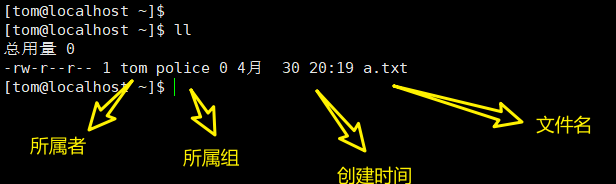
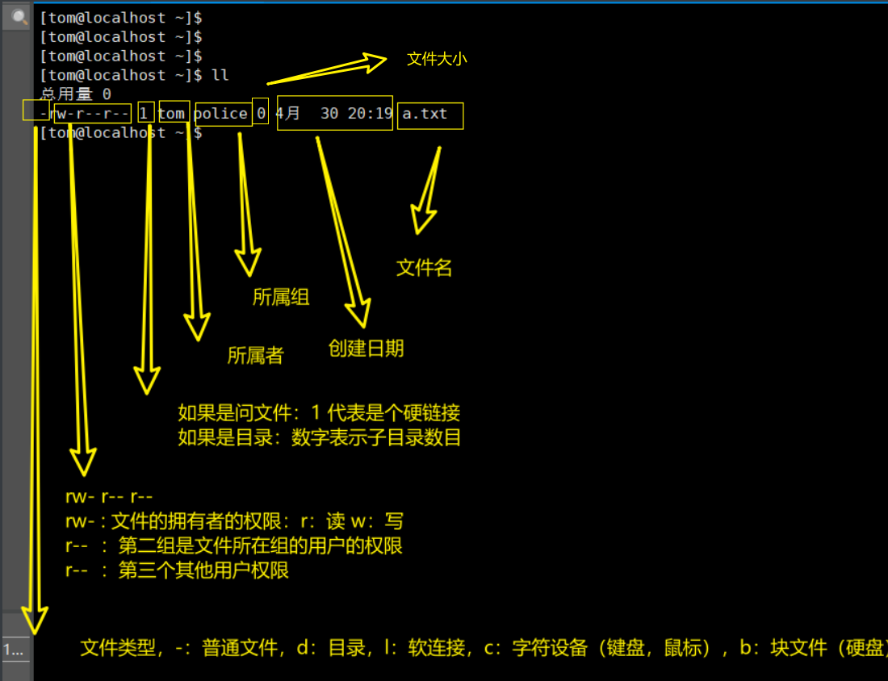
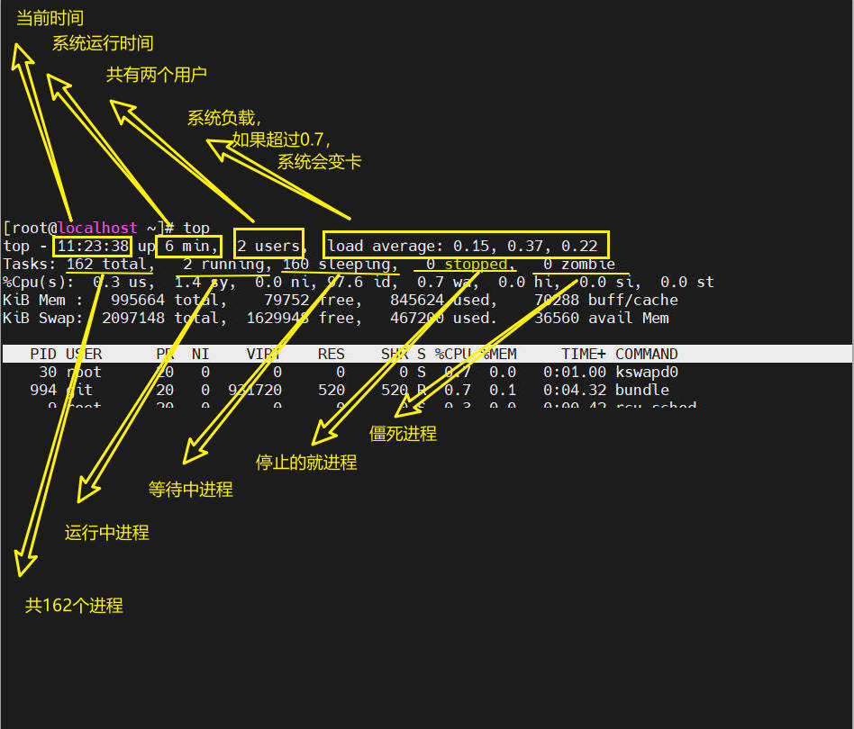
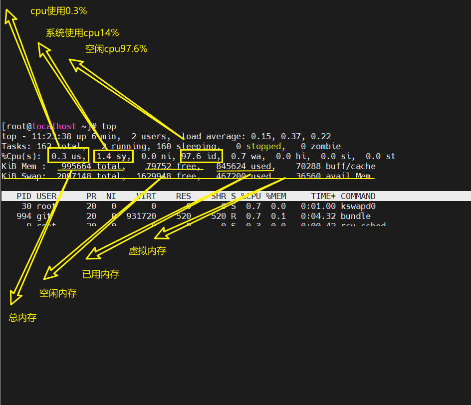

## vi和vim

```sh
# 删除一行
dd
# 删除五行
5dd
# 复制一行
yy
# 复制五行
5yy
# 粘贴
p
# 定位到末行
G
# 定位到首行
gg
# 取消修改的内容
u
# 定位到20行
20 + shift + g

# 设置取消行号
:set nu
:set nonu
```

## 关机重启

```sh
# 立即关机
shutdown -h now
# 一分钟后关机
shutdown -h 1
# 立即重启
shutdown -r now

# 关机
halt

# 重启
reboot

# 把内存的数据同步到磁盘
syn
```

## 登录和注销

```sh
# 注销退出登录
logout
```

## 用户管理

- 添加用户

  ```sh
  # 创建用户
  adduser  xm
  passwd xm
  
  # 添加用户到指定用户组
  useradd -d /home/dog xq
  passwd xq
  ```

- 删除用户

  ```sh
  # 删除用户但是保留家目录
  userdel xh
  
  # 删除用户与家目录，一般不会删除家目录	
  userdel -r xq
  ```

- 查看用信息

  ```sh
  # 查看用户信息
  id root
  ```

- 切换用户

  ```sh
  # 切换到root用户
  su - root
  
  # 返回到原来的用户
  exit
  ```

- 查看当前用户

  ```sh
  whoami
  ```

## 用户组

- 增加组

  ```sh
  groupadd wudang
  ```

- 删除组

  ```sh
  groupdel wudang
  ```

- 创建用户时指定组

  ```sh
  # 创建组
  groupadd wudang
  
  # 创建用户并且指定组
  useradd -g wudang zhangwuji
  
  # 查看zhangwuji的信息
  id zhangwuji
  ```

- 修改用户组

  ```sh
  # 创建组
  groupadd shaolin
  
  # 修改分组
  usermod -g shaolin zhangwuji
  
  # 查看zhangwuji的信息
  id zhangwuji
  ```

## 文件目录类

- 创建空文件

  ```sh
  # 创建一个空文件
  touch abc.txt
  
  #创建多个空文件
  touch abc.txt def.txt
  ```

- 复制

  ```sh
  # 递归复制全部文件
  cp -r abc.txt ./../abc.txt
  
  #强制覆盖
  \cp -r abc.txt ./../abc.txt
  ```

- 查看

  ```sh
  # 带行号
  cat -n /etc/profile
  
  # 分页查看
  cat -n /etc/profile | more
  
  # 分页查看 
  # 空格 下一页 ；下方向 下一行； ctrl+b 下一页； ctrl + f 上一页； q 离开； = 输出当前行号； :f 输出当前文件名和行号
  more /etc/profile
  
  # less 和more类似，且比more强大
  # 空格 下一页 ； pageup 上一页； pagedown 下一页； /字符串 向下查找 n向下 N向上； ？ 向上查找； q 退出
  less
  ```

- \> 和 \>>

  ```sh
  # > 覆盖
  ll > a.txt
  cat a.txt > b.txt
  aaa > c.txt
  cal > d.txt
  
  # >> 追加到文件的尾部
  ll >> a.txt
  cat a.txt >> b.txt
  aaa > c.txt
  ```

- 查看日历

  ```sh
  cal
  date
  ```

- echo和head和tail

  ```sh
  # echo 输出环境变量或者文本
  echo $JAVA_HOME
  echo $PATH
  echo abc
  
  # head 显示文件的开头
  head /etc/profile # 默认显示前十行
  head -n 5 /etc/profile #查看前五行
  
  # tail
  tail -f log.log
  tail -n 5 /etc/profile #查看后五行
  
  
  ```

- 软连接

  ```sh
  # 创建 软连接
  ln -s /root/ linkToRoot
  
  # 删除原链接
  rm -rf linkToRoot
  ```

- history

  ```sh
  # 查看所有的命令
  history
  
  # 查看前10 个
  history 10
  
  # 执行第几个命令
  !10
  
  
  ```

## 时间日期类

- date

  ```sh
  # 显示当前时间
  date	#当前时间
  date +%Y	# 年
  date +%Y-%m-%d	# 年月日
  date "+%Y-%m-%d %H:%M:%S" 	#年月日时分秒
  
  # 设置日期
  date -s "2022-04-08 11:11:11"
  ```

- 查看日历

  ```sh
  # 当前月
  cal
  # 查看某年的日历
  cal 2020
  ```

## 搜索查找类

- find

  ```sh
  # 查找/root目录下的某文件
  find /root -name a.txt
  find /root -name "a*"	# 通配符
  
  # 查询root用户下的文件（文件的拥有者）
  find /opt -user root
  
  # 根据文件大小查找
  find -size +20M # 大于20M的文件
  find -size -20M # 小于
  find -size 20M	# 等于
  ```

- locate

  ```sh
  # 创建loate数据库
  
  ```

## 压缩

- .gz

  ```sh
  # 压缩
  gzip hello.txt # 压缩完后原文件不保留 
  
  # 解压
  gunzip hello.txt.gz	# 解压完后原文件消失
  
  ```

- .tar.gz

  ```sh
  # 将两个文件压缩
  tar -zcvf bc.tar.gz b.txt c.txxt
  
  # 解压
  tar -zxvf xxx.tar.gz
  
  # 解压到指定目录
  tar -zxvf xxx.tar.gz -C /opt
  ```

- .zip

  ```sh
  # 压缩整个文件夹
  zip -r mypackage.zip /home/*
  
  # 解压到指定目录
  unzip -d /opt/ mypackage.zip 
  ```

## 用户组

- 文件的所有者

```sh
# 创建用户
groupadd police 
useradd -g police tom
passwd tom
su - tom
touch a.txt
ll
```



- 修改文件所属

  ```sh
  touch apple.txt
  chown tom  apple.txt
  ll
  ```

  

- 修改文件所在组

  ```sh
  touch orage.txt
  chgrp police orage.txt
  ll
  ```

* 用户改变所在组

  ```sh
  # 查看用户所在组
  id tom
  # 创建组
  groupadd bandi
  # 修改组
  usermod -g bandi tom
  # 查看组
  id tom
  ```

## 权限

- 说明

  

  说明：权限里面的x代表可执行（可进入）

### 权限的管理方式一

说明：

u：所有者；g：所有组；o：其他人；a：所有人（ago的总和）

```sh
# 赋予权限
chmod u=rwx,g=rx,o=x 文件目录名

# 给其他人增加写权限
chmod o+w 文件目录名

# 给所有人去掉执行权限
chmod a-x 文件目录名
```

### 权限管理方式二

说明：

r =4 w=2 x =1； rwx = 4+2+1 =7

```sh
chmod u=rwx,g=rx,o=x 文件名
# 相当于
chmod 751 文件名
```

### 修改文件所有者

说明

chown newowner file  修改文件所有者

chown newowner:newgroup file	修改文件所有者及所有组

```sh
# 递归修改文件的所有者
chown -R tom kkk/

# 递归修改用户组
chgrp -R bandi kkk/
```

### 总和实践

```sh

```

## 定时任务crond

- cornd[选项]

  ```sh
  -e #编辑
  -l #查询
  -r #删除（删除当前用户下的全部）
  ```

- 简单的定时任务

  ```sh
  # 创建定时任务
  crontab -e
  
  # 输入后保存则生效
  */1 * * * * ls -l /etc >> /tmp/to.txt
  ```

- 定时执行脚本

  ```sh
  cd /home/
  vim mytask.sh
  # 输入
  date >> /tmp/mydate
  # 赋予权限
  chmod 744 mytask.sh
  # 创建定时任务
  crontab -e
  # 追加
  */1 * * * * /home/mytask.sh
  ```

## 磁盘分区和挂载

```sh
# 查看分区情况
lsblk -f
# 可以看分区大小
lsblk
```

### 查询磁盘情况

```sh
# 查看磁盘使用情况
df -lh

# 查看指定目录
du -h
du -h /opt

# --max-depth 为统计的深度
du -ach --max-depth=1 /opt/

# 统计某目录下的文件书
# "^-"：以-开头的 wc -l：统计
ll /root/ | grep "^-" | wc -l
# 递归统计
ll -r /root/ | grep "^-" | wc -l

# 安装tree
yum install tree
# 使用tree
tree

```

## 网络配置

- 固定ip

  ```sh
  cd /etc/sysconfig/network-scripts
  
  vim ifcfg-ens33
  
  
  ```

## 进程管理

- 查看进程 ps

  ```sh
  # 查看父进程
  ps -ef | grep java
  # 查看进程
  ps -aux | grep tomcat
  
  ps 
  ps -a # 显示所有进程信息
  ps -u # 以用户的格式显示信息
  ps -x # 显示后台进程运行的参数	
  
  # 分页查看 
ps -aux | more
  
  # 过滤
  ps -aux | grep tomcat
  
  # 咋没有这个功能
  pstree -p
  ```

- 终止进程 kill & killall

  ```sh
  # 根据pid -9是立刻杀死
  kill [-9] 123456
  # 根据进程名称，可用用通配符
  killall 进程名 
  ```

## 服务管理

注：centos6 中用service，在centos7中使用systemctl

- 临时生效

  ```sh
  # 操作防火墙
  systemctl start firewalld
  systemctl status firewalld
  systemctl restart firewalld
  systemctl stop firewalld
  ```

- 永久生效

  ```sh
  
  ```

- 查看服务

  ```sh
  
  ```

- 运行级别

  ```sh
  # 查看运行级别
  chkconfig --list
  
  # 过滤
  chkconfig --list | grep network
  
  # 查看指定服务
  chkconfig network --list
  
   # 修改重启后生效
  chkconfig --level 5 network off
  chkconfig --level 5 network on
  ```

## 服务动态监控

- 监控进程

  ```sh
  # 动态查看进程
  # top后输入 -u 可以选择用户
  # top后输入 k 加 进程号 则可以停止某进程
  top
  
  # 指定刷新时间
  top -d 10 # 10秒刷新一次
  
  # 按q退出
  # 输入 P 按pid排序
  # 输入 M 按内存使用情况排序
  
  ```

  

  

- 网络监控

  ```sh
  netstat -nlpt
  # 查看所有的服务
  netstat -anp
  # 查看某个进程
  netstat -anp | grep sshd
  ```

## rpm 和yum

- rpm

  ```sh
  # 查询是否安装了某软件
  rpm -qa | grep ssh
  
  # 查看所有
  rpm -qa |more
  ```

  


