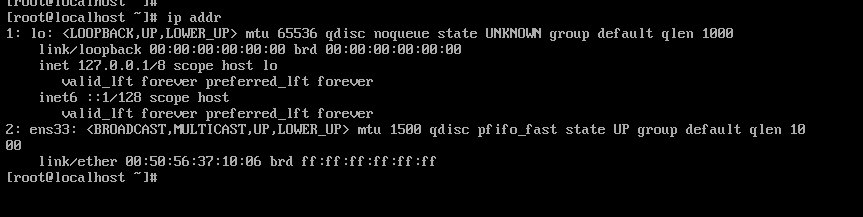
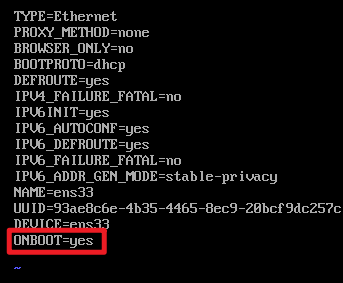
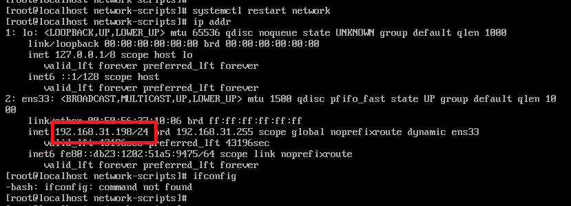
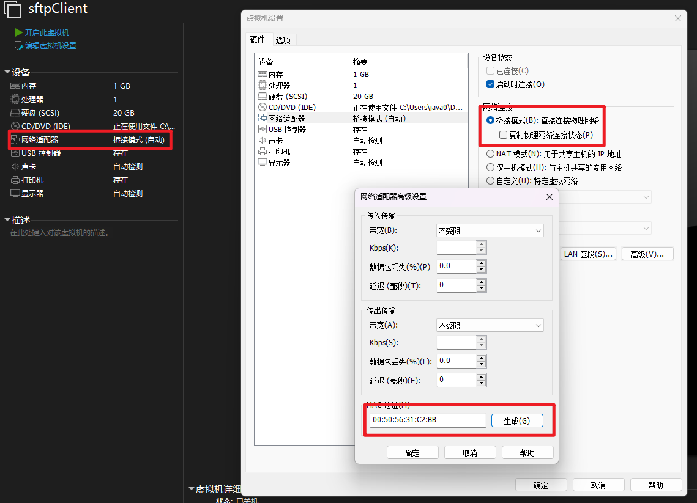
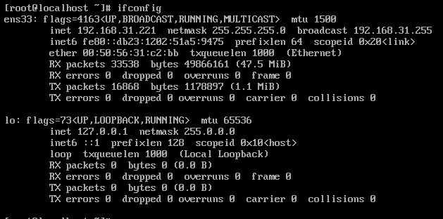

## 下载地址

### 华为

```http
https://repo.huaweicloud.com/centos/
```

### 阿里

```http
https://mirrors.aliyun.com/centos/
```

### 版本区别

Minimal：最简单的，不带桌面

DVD：完整的系统

## 配置

### 没有IP



- 修改配置文件

```sh
vi /etc/sysconfig/network-scripts/ifcfg-ens33
```




- 重启网络

```sh
systemctl restart network
```



- 关闭虚拟机，设置网络连接模式



- 关闭防火墙

```sh
#这个亲测可用
systemctl stop firewalld.service
#开机禁止启动
systemctl disable firewalld.service
```

- 安装软件

```sh
yum provides ifconfig
yum install net-tools
```



之后可以通过 xshell 进行链接