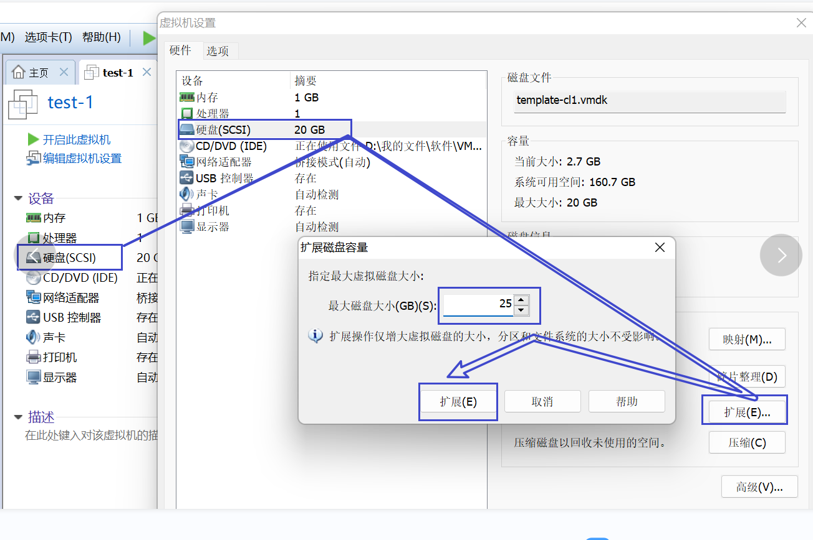

## 添加物理硬盘

- 关机
- 
- 开机

## 配置

```sh
# 查看磁盘状态
fdisk -l

# 开始分区
fdisk /dev/sdb	

# 输入 m 查看帮助
# 输入 n 添加一块分区
# 输入 p 添加主分区
# 以下皆默认
分区号 (3,4，默认 3)：
起始 扇区 (41943040-52428799，默认为 41943040)：
将使用默认值 41943040
Last 扇区, +扇区 or +size{K,M,G} (41943040-52428799，默认为 52428799)：
将使用默认值 52428799
分区 3 已设置为 Linux 类型，大小设为 5 Gi
命令(输入 m 获取帮助)：
# 输入 w 将上述保存（写入）

# 再次查询详情
fdisk -l
```

两次对比


继续

```sh
# 重启
shutdown -r now li
# 格式化
mkfs.ext4 /dev/sda3

# 创建空文件夹
mkdir /mnt/mytest
# 挂载硬盘
mount -t ext4 /dev/sda3 /mnt/mytest

# 测试
cd /mnt/mytest
ls
touch f1
df -h

# 设置开机自动挂载
vim /etc/fstab
/dev/sdb2 /mnt/mytest ext4 defaults 0 0

# 验证
df -lh
```

