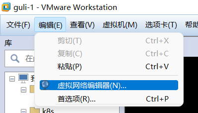
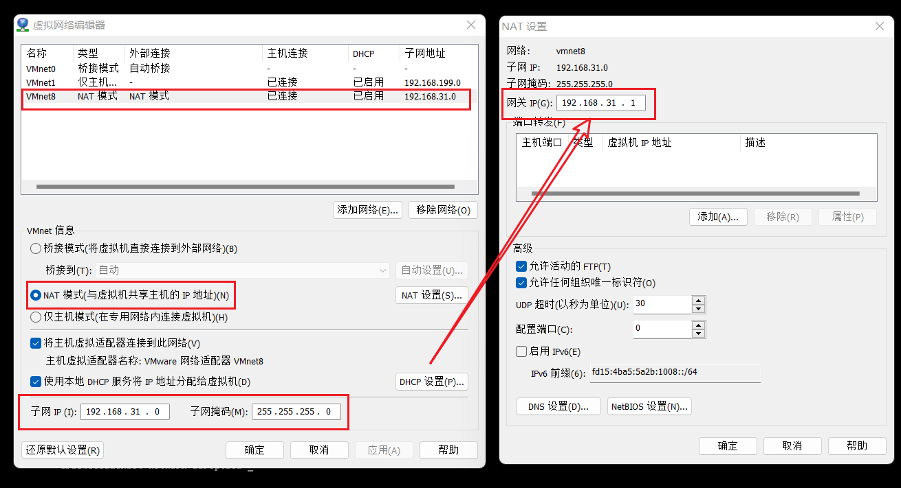
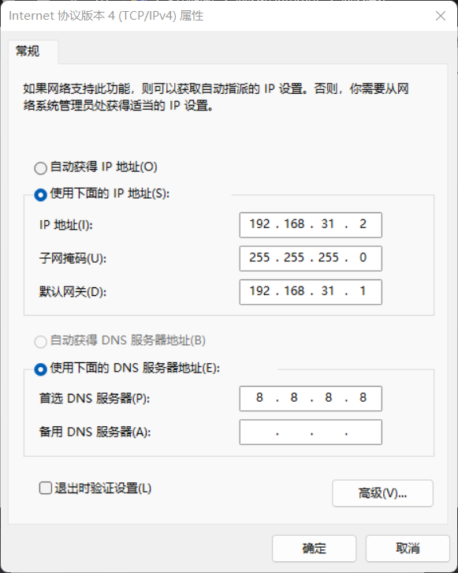
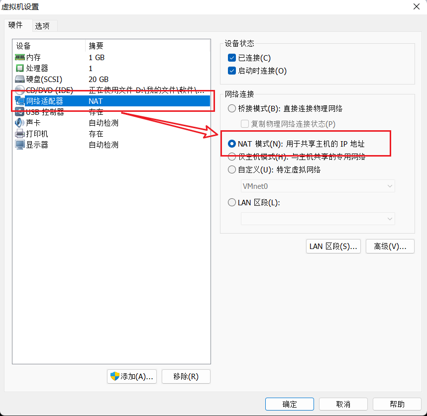

## 修改软件及电脑配置









## 修改linux的配置文件

```sh
cd /etc/sysconfig/network-scripts
vim ifcfg-ens33
```

原文件

```sh
TYPE=Ethernet
PROXY_METHOD=none
BROWSER_ONLY=no
BOOTPROTO=dhcp
DEFROUTE=yes
IPV4_FAILURE_FATAL=no
IPV6INIT=yes
IPV6_AUTOCONF=yes
IPV6_DEFROUTE=yes
IPV6_FAILURE_FATAL=no
IPV6_ADDR_GEN_MODE=stable-privacy
NAME=ens33
UUID=00092ce7-6806-4420-9373-3e07fe351485
DEVICE=ens33
ONBOOT=yes
```

修改后

```sh
TYPE=Ethernet
PROXY_METHOD=none
BROWSER_ONLY=no
BOOTPROTO=static
DEFROUTE=yes
IPV4_FAILURE_FATAL=no
IPV6INIT=yes
IPV6_AUTOCONF=yes
IPV6_DEFROUTE=yes
IPV6_FAILURE_FATAL=no
IPV6_ADDR_GEN_MODE=stable-privacy
NAME=ens33
UUID=00092ce7-6806-4420-9373-3e07fe351485
DEVICE=ens33
ONBOOT=yes

IPADDR=192.168.73.100
NETMASK=255.255.255.0
GATEWAY=192.168.73.1
```

```sh
# 刷新
service network restart
```


